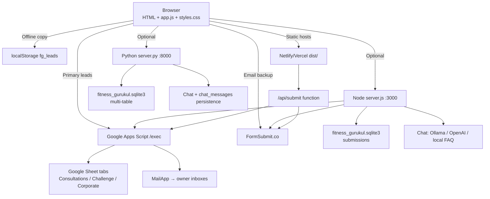
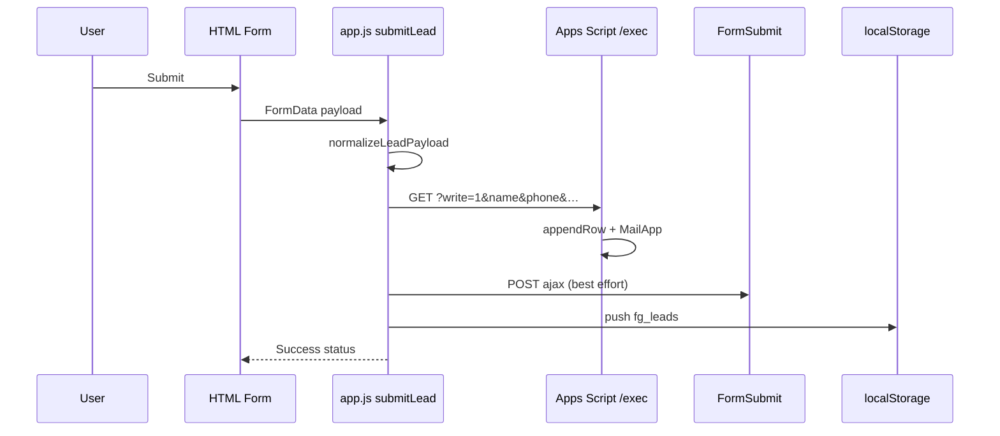

# Fitness Gurukul — Detailed Code Documentation

Comprehensive technical documentation of the Fitness Gurukul website codebase: architecture, every major file, data catalogs, APIs with example payloads, lead/chat flows, databases, deployment, and operational notes.

> Companion docs: [`README.md`](./README.md) (quick start) · [`AGENTS.md`](./AGENTS.md) (Cursor Cloud agent notes)

---

## Table of contents

1. [Project overview](#1-project-overview)
2. [Tech stack & what is used](#2-tech-stack--what-is-used)
3. [Repository structure](#3-repository-structure)
4. [Architecture & runtime modes](#4-architecture--runtime-modes)
5. [Business content catalogs](#5-business-content-catalogs)
6. [Frontend deep dive (`app.js`)](#6-frontend-deep-dive-appjs)
7. [Styles & design system (`styles.css`)](#7-styles--design-system-stylescss)
8. [HTML pages (what each page does)](#8-html-pages-what-each-page-does)
9. [Node backend (`server.js`)](#9-node-backend-serverjs)
10. [Python backend (`server.py`)](#10-python-backend-serverpy)
11. [Lead capture system (end-to-end)](#11-lead-capture-system-end-to-end)
12. [Google Apps Script (`Code.gs`)](#12-google-apps-script-codegs)
13. [Serverless submit handlers](#13-serverless-submit-handlers)
14. [Chatbot system](#14-chatbot-system)
15. [Database schemas](#15-database-schemas)
16. [Complete API reference](#16-complete-api-reference)
17. [Assets & media map](#17-assets--media-map)
18. [Environment variables](#18-environment-variables)
19. [Scripts, tests & CI](#19-scripts-tests--ci)
20. [Deployment guides](#20-deployment-guides)
21. [Browser storage keys](#21-browser-storage-keys)
22. [Contact & integration constants](#22-contact--integration-constants)
23. [Key function index](#23-key-function-index)
24. [Troubleshooting](#24-troubleshooting)
25. [Known caveats & drift](#25-known-caveats--drift)

---

## 1. Project overview

Fitness Gurukul is a **multi-page marketing + lead-gen website** for a Hyderabad fitness brand offering:

- In-person personal training plans (Core / Prime / Signature)
- Virtual plans (Elite, Endurance running, Forge Hyrox/OCR)
- Yoga, sports, kids, rehab, and special-needs coaches
- Community events (rides, runs) and corporate wellness inquiries
- A 90-day transformation challenge funnel
- Client tools (BMI and other calculators)
- An always-on free FAQ chatbot (optional local Ollama AI)

### Product goals encoded in the code

1. Convert visitors into **leads** (consultation / challenge / corporate)
2. Route those leads into **Google Sheets + email** without requiring paid APIs
3. Optionally keep a **local SQLite copy** when a Node/Python server is running
4. Answer common questions via **chat** without a paid LLM by default
5. Deploy as either a **full Node service** (Render) or **static + serverless** (Netlify/Vercel)

### What this is *not*

- Not a React/Vue/Next SPA
- Not a CMS (content lives in HTML + `realData` in `app.js`, optionally served by `/api/content`)
- Not a paid SaaS chat product (OpenAI is opt-in only)

---

## 2. Tech stack & what is used

### Frontend stack

| Technology | Where | Why it is used |
|------------|-------|----------------|
| HTML5 multi-page | Root `*.html`, `coaches/*.html` | SEO-friendly pages, simple deploy |
| CSS3 (`styles.css`) | Global | Dark brand system, layouts, responsive rules (~17k lines) |
| Vanilla JavaScript (`app.js`) | Shared runtime | Rendering, forms, chat, carousels; no bundler |
| Google Fonts — Public Sans | `<link>` in HTML | Body + display font |
| Netlify Forms attrs | `data-netlify="true"`, `__forms.html` | Form detection at Netlify build time |
| FormSubmit.co AJAX | Browser + servers | Email backup with no API key |
| Google Apps Script | External `/exec` web app | Sheet append + `MailApp` email |
| localStorage / sessionStorage | Browser | Offline lead copies, calculator history, banner dismiss |
| WhatsApp deep links | `wa.me/917207113310` | Floating chat CTA |
| GitHub media CDN fallback | `app.js` media error handler | Rewrite broken local media URLs |

### Node backend stack

| Package | Version | Role |
|---------|---------|------|
| `express` | ^4.18.2 | HTTP server, routing, static files |
| `cors` | ^2.8.5 | Allow cross-origin API calls |
| `sql.js` | ^1.11.0 | SQLite compiled to WASM; persists `fitness_gurukul.sqlite3` |
| Node built-ins | `fs`, `path`, `fetch` | Env file, DB I/O, outbound HTTP |

**Entry:** `server.js`  
**Scripts:** `npm start` / `npm run dev` → `node server.js`  
**Default port:** `3000` (`PORT` env override)

### Python backend stack

| Piece | Role |
|-------|------|
| `http.server.ThreadingHTTPServer` | Concurrent request handling |
| `sqlite3` | Native SQLite |
| `urllib`, `json`, `os`, `re`, `time` | HTTP helpers, chat providers |
| `requirements.txt` | Empty marker — **no pip packages** |

**Entry:** `server.py`  
**Default port:** `8000`

### Integrations & hosting

| Piece | Role |
|-------|------|
| `google-apps-script/Code.gs` | Lead Sheet writer + email |
| `api/submit.js` | Vercel serverless lead endpoint |
| `netlify/functions/submit.ts` | Netlify Function lead endpoint |
| `netlify/functions/_shared/lead-mail.ts` | Shared FormSubmit helper |
| Ollama (`/api/tags`, `/api/chat`) | Free local LLM (optional) |
| OpenAI Responses API | Paid LLM (opt-in) |
| Render / Netlify / Vercel / GitHub Actions | Deploy & CI |

---

## 3. Repository structure

```text
.
├── DOCUMENTATION.md          ← this file
├── README.md                 ← quick start
├── AGENTS.md                 ← Cursor Cloud notes
├── package.json              ← Node deps + scripts
├── package-lock.json
├── requirements.txt          ← Python marker (stdlib only)
├── .env.example              ← env template
├── .gitignore                ← ignores sqlite, .env, node_modules, dist
│
├── server.js                 ← PRIMARY full-stack Node server
├── server.py                 ← Alternate full-stack Python server
├── app.js                    ← Shared frontend runtime (~3.4k lines)
├── styles.css                ← Global CSS design system
│
├── index.html … tools.html   ← Marketing pages (see §8)
├── admin.html                ← Node admin UI
├── owner-data.html           ← Python owner data viewer
├── __forms.html              ← Hidden Netlify form skeletons
├── coaches/*.html            ← Individual coach profiles
│
├── api/submit.js             ← Vercel serverless POST /api/submit
├── netlify/functions/…       ← Netlify submit + lead-mail helper
├── google-apps-script/Code.gs
├── scripts/
│   ├── prepare-static-dist.sh
│   └── smoke-leads.sh
│
├── assets/  gallery/  services/  screens/  testimonials/
├── index/   "story map"/  new-ind/
│
├── vercel.json  netlify.toml  render.yaml
└── .github/workflows/
    ├── node.js.yml
    └── deploy-vercel.yml
```

---

## 4. Architecture & runtime modes



### Mode comparison

| Concern | Node (`npm start`) | Python (`python server.py`) | Static Netlify/Vercel |
|---------|--------------------|-----------------------------|------------------------|
| Port | 3000 | 8000 | CDN |
| DB | `submissions` via sql.js | Multi-table sqlite3 | None |
| Lead API | `POST /api/submit` | `POST /api/leads` | Function `POST /api/submit` + browser Apps Script |
| Sheets + email from server | Yes | No | Yes (function) |
| Admin UI | `/admin` | `owner-data.html` | N/A |
| Chat API | Yes | Yes (+ persists messages) | No (browser local FAQ only) |
| Calculators API | No | `POST /api/calculations` | No |

**Rule:** do not run Node and Python against the same expectations — schemas and admin endpoints differ.

---

## 5. Business content catalogs

These catalogs are embedded in `app.js` as `realData` (and mirrored in `server.js` / `server.py` for chat/content APIs).

### 5.1 Coaching plans / services

| Name | Category | Sessions | Price (as in code) | Accent |
|------|----------|----------|--------------------|--------|
| Fitness Gurukul Core | `core` | 1 per week | From ₹5,999/mo | blue |
| Fitness Gurukul Prime | `prime` | 3 per week | From ₹9,500/mo | red |
| Fitness Gurukul Signature | `signature` | 5 per week | ₹15,999/mo | cyan |
| Fitness Gurukul Endurance | `endurance` | Virtual | ₹1,199/mo | amber |
| Fitness Gurukul Forge | `forge` | Virtual | ₹999/mo | orange |
| Virtual 1:1 Elite Transformation | `elite` | Virtual | From ₹1,999/mo | purple |

**Service object fields:**

```js
{
  name, tag, category, summary, price, accent,
  points: string[],   // feature bullets
  sessions,           // e.g. "3 per Week" | "Virtual"
  link                // in-page anchor e.g. "#prime"
}
```

### 5.2 Coaches (from `realData.coaches`)

| Name | Slug | Category | Highlight |
|------|------|----------|-----------|
| Aditya Gururani | `aditya-gururani` | yoga | Breathwork Expert |
| B Yashwanth | `b-yashwanth` | sports | Sports Specialist |
| Shivajeet Kanaujiya | `shivajeet-kanaujiya` | fitness | Strength Builder |
| Anand Yadav | `anand-yadav` | kids | Kids Fitness Expert |
| Aditya | `aditya` | yoga | Mind-Body Coach |
| Nitu Arya | `nitu-arya` | yoga | Holistic Yoga |
| Rahul Bisht | `rahul-bisht` | yoga | Mobility Master |
| Deepesh Kumar | `deepesh-kumar` | fitness | Weight Loss Specialist |
| S Jeetender | `s-jeetender` | fitness | Daily Fitness Pro |
| Rahul Dawar | `rahul-dawar` | fitness | Health & Strength |
| Rahul Singh Pawar | `rahul-singh-pawar` | yoga | Stress Relief Expert |
| Ravi Pal | `ravi-pal` | rehab | Injury Recovery |
| Sanjeev | `sanjeev` | fitness | Strength Trainer |
| Nandlal | `nandlal` | fitness | Transformation Coach |
| Prasenjit Ghosh | `prasenjit-ghosh` | hybrid | Hybrid Training |
| Vinay Ojha | `vinay-ojha` | fitness | All-Round Fitness |
| Ankit Singh Chauhan | `ankit-singh-chauhan` | fitness | Calisthenics Expert |
| Suresh Yadav | `suresh-yadav` | special | Special Needs Expert |
| Parul Danu | `parul-danu` | yoga | Yoga & Wellness |
| Raju | `raju` | fitness | Fitness Guide |
| Vishal Choudhary | `vishal-choudhary` | fitness | Personal Training Pro |
| Devendra Mittal | `mittal` | fitness | Strength & Conditioning |
| Shashi Mishra | `shashi-mishra` | fitness | Wellness Coach |

**Coach object fields:** `name`, `role`, `slug`, `category`, `bio`, `focus[]`, `highlight`, `color`, `image`.

Profile HTML pages exist under `coaches/` for most of these slugs (paths use `../styles.css` and `../app.js`).

### 5.3 Featured testimonials

| Name | Result | Before → After |
|------|--------|----------------|
| Udit Narayan | Body Recomposition | 88 → 74 kg |
| Neha Chopra | Weight Loss | 82 → 65 kg |
| Ramakrishna | Weight Loss | 88 → 74 kg |
| Deepak | Weight Loss | 90 → 76 kg |

Each includes `quote`, `rating`, `galleryImage`, `journey[]`, and `coach`.

### 5.4 Latest event banner (`LATEST_EVENT`)

Injected on most public pages via `injectLatestEventBanner()`:

| Field | Value |
|-------|-------|
| Name | Independence Day Ride |
| Date | 16 August 2026 |
| Time | 5:00 AM onwards |
| Location | SmartBike Point, Narsingi |
| Register | `https://ifinish.in/cycling/IND_26` |
| Details | `events.html#latest-event` |

Dismiss state: `sessionStorage["fg-hide-latest-event-banner"] = "1"`.

### 5.5 Workouts

- Compact list in `realData.workouts` (`n` name, `c` category, `l` level, `d` duration)
- Richer `curatedWorkouts` with `summary` + Indian `diet` notes for overlay UI

---

## 6. Frontend deep dive (`app.js`)

`app.js` is the single shared client runtime loaded by nearly every page (typically `app.js?v=…` with `defer`).

### 6.1 Boot sequence (`boot()`)

Executed at the end of the file. Each step is try/caught so one failure does not block the rest:

1. `initPlanModals()` — wire plan overlay buttons early  
2. Seed `renderServices(realData.services)`  
3. `await detectBackend()` → `GET /api/health` → sets `usesLocalBackend`  
4. `await loadContent()` → `GET /api/content` or fall back to `realData`  
5. Render: services, coaches, testimonials, updates, areas, workouts, contact  
6. Inject ambient background, hero content, minds carousel  
7. Init carousels, counters, reveal animations, home page helpers  
8. Inject/wire coach modal, book modal, forms, nav  
9. `refreshAdminData()` (no-op on pages without admin DOM)  
10. Inject latest-event banner, footer, WhatsApp float, chatbot  
11. Misc motion helpers / cycle carousel  

### 6.2 Core utilities

| Function | Behavior |
|----------|----------|
| `qs` / `qsa` / `has` | DOM helpers |
| `safe(value)` | HTML-escape for injected text |
| `list(items)` | Join array for display |
| `api(path, options)` | `fetch` + JSON parse, **5s abort** timeout |
| `detectBackend()` | Sets global `usesLocalBackend` from `/api/health` |
| `slugify`, `formatDate`, `formatTime` | Display helpers |

### 6.3 Lead submission (browser path)

**Important:** marketing forms call `submitLead()`, **not** `POST /api/submit`.

```text
bindLeadForm / wireForms
  → preventDefault
  → FormData → payload
  → submitLead(payload)
       normalizeLeadPayload  (requires name + phone)
       postLeadToGoogleScript  (GET Apps Script ?write=1&…)
       emailLeadViaFormSubmit  (best-effort, both emails)
       saveLeadLocally         (fg_leads)
  → status UI green/red
```

**Exported globals:**

- `window.fgSubmitLead`
- `window.FG_GOOGLE_SCRIPT_URL`
- `window.FG_LEAD_NOTIFY_EMAILS`

**Wired forms:**

| Selector | Defaults | Page |
|----------|----------|------|
| `#leadForm` | `form_type: consultation` | contact |
| `#consultPageForm` | `form_type: consultation` | book-consultation |
| `#challengeLeadForm` | `form_type: transformation_challenge` | transformation-challenge |
| `#bookModalForm` / coach forms | consultation | modals |
| `#corpEventForm` | `form_type: corporate_event` | events (IIFE) |

**Normalized lead fields:**

`form_type`, `name` (or `contact_name`), `phone`, `email`, `timestamp`, `source`, plus optional `program`, `goal`, `message`, `coach`, `company`, `event_type`, `attendees`, `preferred_date`, `budget`, `location`.

CORS note: Apps Script responses are often opaque; `postLeadToGoogleScript` treats a successfully sent request as OK and may retry with `mode: "no-cors"`.

### 6.4 Chat widget (`injectSiteChatbot`)

DOM root: `.fg-chatbot`

| Nested helper | Role |
|---------------|------|
| `setOpen` | Open/close panel |
| `appendMessage` | User/bot bubbles |
| `setTyping` | Typing indicator |
| `renderSuggestions` | Up to 4 chips |
| `findMatchingPlans` / `localChatReply` | Offline FAQ |
| `requestChatReply` | `POST /api/chat` when backend present (65s timeout) |
| `loadChatStatus` | `GET /api/chat/status` |
| `submitChat` | Orchestrates send |

Session id format: `fg-<base36-time>-<random>`.

Default suggestion chips:

- Which plan is best for weight loss?
- Compare Core, Prime and Signature
- Do you have running or Hyrox plans?
- Which coach is best for yoga?

### 6.5 Rendering modules

| Area | Key functions | DOM hooks |
|------|---------------|-----------|
| Services | `renderServices`, `getServiceCatalog`, `showCompareView`, `initPlanModals` | `#servicesGrid`, plan overlays |
| Coaches | `renderCoaches`, `renderFilteredCoaches`, `wireCoachPopups` | `#coachGrid`, `#coachSearch`, `#coachFilters` |
| Testimonials | `renderTestimonials`, `renderStoryMap`, `wireStoryMapFilters` | grids, story map filters |
| Workouts | `renderWorkoutGrid`, `openWorkoutOverlay` | workout grid + overlay |
| Contact | `renderContact` | `[data-contact-phone]`, etc. |
| Admin | `refreshAdminData`, `renderAdminTable` | owner-data table body |

### 6.6 Chrome injection

| Function | Injects |
|----------|---------|
| `injectFooter` | Replaces any `.site-footer` with `footer-refresh` footer |
| `injectWhatsAppFloat` | `.wa-float` → `wa.me/917207113310` |
| `injectLatestEventBanner` | Top event bar |
| `injectBookModal` / `injectCoachModal` | Booking + coach popup shells |
| `injectAmbientBg` | Decorative ambient orbs |
| `injectSiteChatbot` | AI chat widget |
| Site popup IIFE | `#sitePopup` auto-opens after **300000 ms** (5 minutes) |

### 6.7 Media fallback IIFE

On `error` for `img` / `video` / `source`, local paths are rewritten to:

`https://media.githubusercontent.com/media/saikrishnacoder/i-want-you-to-creating-a/main/<path>`

### 6.8 Auth stubs (localStorage only)

`getUsers` / `saveUsers` / `getSession` / `saveSession` / `clearSession` / `hash` / `currentUser` — present but `injectAuthModal` / `wireAuth` are effectively stubs. Not a production auth system.

### 6.9 Tools page calculators (`tools.html`)

Implemented in page-local JS (not `app.js`):

| Slug | Formula / idea |
|------|----------------|
| `bmi` | weight / height² |
| `1rm` | Epley 1RM |
| `tdee` | Mifflin-St Jeor × activity |
| `bodyfat` | Estimate from BMI |
| `ideal-weight` | Devine formula |
| `lean-body-mass` | LBM |
| `protein` | Daily protein target |
| `macro` | Macro split |
| `whr` | Waist-to-hip ratio |
| `max-hr` | Max heart rate |
| `sleep` | Sleep timing helper |
| `bmd` | Bone health risk assessment |

On calculate:

1. Prepend to `localStorage["fg_calculator_results"]` (cap 50)  
2. Best-effort `POST /api/calculations` (Python only)

---

## 7. Styles & design system (`styles.css`)

### CSS custom properties (`:root`)

| Token | Value | Use |
|-------|-------|-----|
| `--bg` | `#000000` | Page background |
| `--bg-2` | `#0a0a0a` | Secondary background |
| `--surface` / `--surface-2` | `#111` / `#1a1a1a` | Cards, panels |
| `--line` / `--line-strong` | white alpha | Borders |
| `--text` / `--muted` / `--soft` | `#fff` / `#999` / `#ccc` | Typography |
| `--accent` / `--white` | `#ffffff` | Emphasis |
| `--shadow` / `--shadow-lg` | heavy black shadows | Elevation |
| `--radius` / `--radius-lg` | 12px / 18px | Corners |
| `--font-body` / `--font-display` | Public Sans | Type |
| `--challenge-green` etc. | `#25d366` | Challenge / WhatsApp accents |

### Major CSS section themes (by comment blocks)

- Global reset / tokens / buttons / forms  
- Site header, desktop/mobile nav  
- Fittr-style homepage hero & carousels  
- Lives transformed / ecosystem / minds behind  
- Coach cards, service cards, compare overlays  
- Events, challenge page, tools calculators  
- Chatbot (`.fg-chatbot-*`), WhatsApp float  
- Responsive rules (~480–1020px+)  
- `prefers-reduced-motion` handling in places  

### Shared layout classes

`.page-shell`, `.section-shell`, `.site-header`, `.desktop-nav`, `.mobile-nav`, `.site-footer` / `.footer-refresh`, reveal animation classes, CTA strips.

---

## 8. HTML pages (what each page does)

### Public marketing pages

| File | Purpose | Notable DOM / JS hooks |
|------|---------|------------------------|
| `index.html` | Home | Hero carousel, services preview, story, app `screens/`, minds carousel |
| `about.html` | Brand / founder (Ravi Miska) | Values, about gallery, CTAs |
| `services.html` | Full plan catalog | `#servicesGrid`, plan modals, compare, FitBudd pay links |
| `coaches.html` | Coach directory | `#coachGrid`, `#coachSearch`, `#coachFilters` |
| `coaches/*.html` | Single coach profile | Hero, focus list, book CTA, optional schedule inject |
| `events.html` | Events + corporate | Ride galleries, `#corpEventForm`, `#latest-event` |
| `testimonials.html` | Stories + videos | Story map, `openStoryVideo()`, MP4s |
| `tools.html` | Calculators | Page-local calculator engine |
| `transformation-challenge.html` | 90-day challenge | `#challengeLeadForm`, video grid, before/after |
| `contact.html` | Consultation + FAQ | `#leadForm`, `#leadStatus` |
| `book-consultation.html` | Dedicated booking | `#consultPageForm` |

### Internal / deploy helpers

| File | Purpose |
|------|---------|
| `admin.html` | Node dashboard: list/delete via `/api/submissions` |
| `owner-data.html` | Python viewer: tabs over `/api/admin-data` |
| `__forms.html` | Hidden Netlify form definitions (`consultation`, `challenge`, `corporate`) |

### Shared page head pattern

Most pages include:

- `styles.css`
- `app.js?v=…` with `defer`
- Logo / brand header
- Desktop + mobile nav
- (Runtime) footer, WhatsApp float, chatbot, event banner

Typical nav targets: Home, Services, Coaches, Events, Testimonials, Tools, Challenge, About/Contact (varies by page).

> Note: injected footer may link to `workouts.html`, which is **not present** in the repo.

---

## 9. Node backend (`server.js`)

### Startup

1. `loadEnvFile()` — parse `.env`, do not overwrite existing env  
2. Mount middleware: `cors`, JSON, urlencoded, `express.static(__dirname)`  
3. `initDatabase()` — open/create sql.js DB + `submissions` table  
4. `resolveChatEngine()` — log which chat engine is active  
5. Listen on `PORT` (default 3000)

### Middleware stack

```js
app.use(cors());
app.use(express.json());
app.use(express.urlencoded({ extended: true }));
app.use(express.static(__dirname));
```

### Important constants

- `CONTACT` — phone `08042781491`, WhatsApp `+917207113310`, email, Manikonda address  
- `PLANS` — six plans for `/api/content` + chat prompt  
- `CHAT_SUGGESTIONS` — four default chips  
- `GOOGLE_SCRIPT_URL` / `LEAD_NOTIFY_EMAILS` from env with hardcoded defaults  

### Lead notify pipeline

```text
insertSubmission(submission)
  → notifyLeadChannels(submission)
       → forwardLeadToGoogleScript  (GET write=1)
       → emailLeadViaFormSubmit     (if Google didn't email / as backup)
```

Helpers: `leadLabel`, `buildLeadEmailBody`, `googleScriptQuery`.

### Chat pipeline

```text
resolveChatEngine()
  local | ollama (if healthy) | openai (opt-in) | local

generateChatReply(message, history)
  → callOllamaChat OR callOpenAIChat OR generateLocalChatReply
```

Ollama status cache TTL: **15 seconds**. History window: **last 8** turns. Message max: **2000** chars.

OpenAI endpoint used: `https://api.openai.com/v1/responses` with `instructions` = system prompt.

### Routes (Node)

| Method | Path | Handler summary |
|--------|------|-----------------|
| GET | `/` | `index.html` |
| GET | `/admin` | `admin.html` |
| GET | `/api/health` | Node engine + chat flags |
| GET | `/api/content` | `{ ok, plans, contact }` |
| GET | `/api/chat/status` | Engine + suggestions |
| POST | `/api/chat` | Generate reply |
| POST | `/api/submit` | Validate → SQLite → notify |
| GET | `/api/submissions` | All rows, newest first |
| DELETE | `/api/submissions/:id` | Delete one |

**No auth** on admin JSON endpoints.

---

## 10. Python backend (`server.py`)

### Design

- Stdlib-only `ThreadingHTTPServer`
- Serves static files from repo root (`PUBLIC`)
- `Cache-Control: no-store` on responses
- Missing static paths fall back to `/index.html`
- Blocks download of `*.sqlite3`

### Content payload (`content_payload`)

Returns `services`, `plans`, `coaches`, `testimonials`, `updates`, `serviceAreas`, `contact` — richer than Node’s `/api/content`.

### Implemented routes

| Method | Path | Behavior |
|--------|------|----------|
| GET | `/api/health` | DB path, exists flag, table names |
| GET | `/api/content` | Full catalogs |
| GET | `/api/chat/status` | Engine + suggestions |
| GET | `/api/admin-data` | Last 50 rows of each table |
| POST | `/api/leads` | Insert lead (name, phone, goal, program required) |
| POST | `/api/calculations` | Insert calculator result |
| POST | `/api/chat` | Reply + `save_chat_exchange(session_id, …)` |

### Chat differences vs Node

- System prompt includes services + coaches + service areas  
- Local FAQ can match coaches/services more richly  
- Persists every exchange into `chat_messages`  
- Uses `sessionId` from the client (default `"anonymous"`)

### Not implemented (despite older README mentions)

`POST /api/newsletter`, `POST /api/checkins`, `GET /api/stats`, `GET /api/leads` — tables may exist, but no writers/readers for those endpoints today.

---

## 11. Lead capture system (end-to-end)

### Form types

| `form_type` | UI source | Sheet tab |
|-------------|-----------|-----------|
| `consultation` (default) | Contact, book, coach modals | Consultations |
| `transformation_challenge` / `challenge*` | Challenge page | Challenge |
| `corporate_event` / `corporate*` | Events corporate form | Corporate |

### Browser path (production default)



### Server path (Node / Netlify / Vercel)

```text
POST /api/submit  JSON body
  → validate name/phone (and more on Node for consult/corporate)
  → [Node] SQLite insert
  → GET Apps Script write=1
  → FormSubmit if email still needed
  → JSON { ok, google_script, emailed }
```

### Example lead JSON (consultation)

```json
{
  "form_type": "consultation",
  "name": "Asha Rao",
  "phone": "9876543210",
  "email": "asha@example.com",
  "program": "Fitness Gurukul Prime",
  "goal": "Fat loss",
  "message": "Prefer evenings",
  "coach": "Deepesh Kumar",
  "source": "/contact.html",
  "timestamp": "2026-08-11T04:00:00.000Z"
}
```

### Example corporate JSON

```json
{
  "form_type": "corporate_event",
  "company": "Acme Pvt Ltd",
  "contact_name": "Ravi",
  "email": "ravi@acme.com",
  "phone": "9876543210",
  "event_type": "Corporate marathon",
  "attendees": "120",
  "preferred_date": "2026-09-01",
  "budget": "2L",
  "location": "Gachibowli",
  "message": "Need branded T-shirts"
}
```

### Example curl (Apps Script smoke)

```bash
curl -sS -L -G "$GOOGLE_SCRIPT_URL" \
  --data-urlencode "write=1" \
  --data-urlencode "form_type=consultation" \
  --data-urlencode "name=Docs Example" \
  --data-urlencode "phone=9000000000" \
  --data-urlencode "email=docs@example.com" \
  --data-urlencode "source=docs"
```

Expected JSON contains `"ok":true` and usually `"emailed":true`.

---

## 12. Google Apps Script (`Code.gs`)

### One-time setup (from file comments)

1. Open the Google Sheet → **Extensions → Apps Script**  
2. Paste entire `Code.gs` → Save  
3. Run `testSetup` → Allow Sheets + Gmail permissions  
4. **Deploy → New deployment → Web app**  
   - Execute as: **Me**  
   - Who has access: **Anyone**  
5. Copy the `/exec` URL into website env / `app.js` default  
6. After edits: Manage deployments → pencil → New version → Deploy  

Optional: set `SPREADSHEET_ID` if the script is not bound to the Sheet.

### Functions

| Function | Role |
|----------|------|
| `doGet(e)` | If `write=1` or `name`+`phone` → `handleLead_`; else health JSON |
| `doPost(e)` | Parse body → `handleLead_` |
| `handleLead_` | Validate, choose tab, append row, email |
| `sheetTab_` | challenge* → Challenge; corporate* → Corporate; else Consultations |
| `ensureHeader_` | Header row + freeze row 1 |
| `sendLeadEmail_` | `MailApp` to both owner emails |
| `getSpreadsheet_` / `getSheet_` | Resolve spreadsheet/tab |
| `json_` | JSON `ContentService` response |
| `testSetup` | Permission + test email |

### Sheet columns (order)

Timestamp, Form Type, Name, Phone, Email, Program, Goal, Message, Coach, Company, Contact Name, Event Type, Attendees, Preferred Date, Budget, Location, Source.

### Why GET write?

Comments across Node/Netlify/Vercel note that Apps Script `/exec` **POST is unreliable** (often “Page Not Found”), so all production writers use **GET with query params**.

---

## 13. Serverless submit handlers

### Vercel — `api/submit.js`

- CORS: `OPTIONS` → 204; only `POST`  
- Requires `name` or `contact_name`, and `phone`  
- Sets `source` default `vercel-api`  
- Forwards to Apps Script GET; FormSubmit if not emailed  
- **502** if both fail  

### Netlify — `netlify/functions/submit.ts`

- Same conceptual flow as Vercel  
- Env via `Netlify.env.get("GOOGLE_SCRIPT_URL"|"FG_GOOGLE_SCRIPT_URL")`  
- Shared FormSubmit helper: `_shared/lead-mail.ts`  
- Respects `FORMSUBMIT_DISABLE=1`  

Mapped to path `/api/submit` by Netlify Functions conventions.

---

## 14. Chatbot system

### Provider decision tree

```text
CHAT_PROVIDER?
  local     → local FAQ
  ollama    → Ollama if /api/tags OK, else local
  openai    → OpenAI if OPENAI_API_KEY, else local
  auto      → Ollama if available
              else OpenAI only if CHAT_ALLOW_OPENAI=true AND key
              else local FAQ
```

**Default is free.** Having an OpenAI key alone does **not** enable paid chat.

### Local FAQ topics (Node + browser)

- Greetings (`hi` / `hello` / `namaste`)
- Contact / phone / WhatsApp / address
- Core vs Prime vs Signature comparison
- Plan/pricing/weight/muscle/hyrox/running keyword scoring (`planScore` / `findMatchingPlans`)
- Doorstep / home / in-person coaching
- Yoga / coach recommendations
- Events / marathon / cycling / ride

Python adds richer coach/service matching, booking nudges, service areas, thanks handling.

### AI system prompt rules (Ollama/OpenAI)

- Hyderabad fitness consultant tone  
- Ask one follow-up when goal is vague  
- Never invent prices, coaches, dates, medical claims, or contacts  
- Medical/injury/pregnancy → general guidance + see a professional  
- Prefer 2–5 short sentences  
- If unsure → invite free consultation  

### Client vs server chat

| Scenario | Behavior |
|----------|----------|
| Backend detected (`usesLocalBackend`) | `POST /api/chat` with history + sessionId |
| Static hosting only | Browser `localChatReply()` over `realData.services` |

---

## 15. Database schemas

### Node — `submissions`

File: `fitness_gurukul.sqlite3` (gitignored). Persisted by exporting the whole sql.js DB on each write.

| Column | Type | Notes |
|--------|------|-------|
| `id` | TEXT PK | `Date.now().toString(36) + random` |
| `form_type` | TEXT | default `consultation` |
| `name` | TEXT | or from `contact_name` |
| `phone` | TEXT | |
| `email` | TEXT | |
| `program` | TEXT | |
| `goal` | TEXT | |
| `message` | TEXT | |
| `coach` | TEXT | |
| `company` | TEXT | corporate |
| `contact_name` | TEXT | corporate |
| `event_type` | TEXT | corporate |
| `attendees` | TEXT | corporate |
| `preferred_date` | TEXT | corporate |
| `budget` | TEXT | corporate |
| `location` | TEXT | |
| `timestamp` | TEXT | ISO |
| `ip` | TEXT | `x-forwarded-for` or socket |

### Python tables

#### `leads`
`id INTEGER PK AUTOINCREMENT`, `name`, `phone`, `goal`, `program` (NOT NULL), `message`, `created_at INTEGER`

#### `newsletter`
`id`, `email UNIQUE NOT NULL`, `created_at` — **no POST handler yet**

#### `checkins`
`id`, `name`, `weight REAL`, `stamina INTEGER`, `mood`, `created_at` — **no POST handler yet**

#### `ai_scans`
`id`, `name`, `focus`, `summary`, `coach_route`, `camera_used`, `created_at` — **no POST handler yet**

#### `calculator_results`
`id`, `calculator`, `title`, `result`, `unit`, `rating`, `created_at` — written by `POST /api/calculations`

#### `chat_messages`
`id`, `session_id`, `role`, `content`, `source` (default `local`), `created_at` — written on each chat turn

`/api/admin-data` returns up to **50** newest rows for each list.

---

## 16. Complete API reference

### Shared

#### `GET /api/health`

**Node response:**

```json
{
  "ok": true,
  "engine": "node",
  "aiEnabled": false,
  "chatEngine": "local",
  "free": true
}
```

**Python response:**

```json
{
  "ok": true,
  "database": "/path/fitness_gurukul.sqlite3",
  "databaseExists": true,
  "tables": ["ai_scans", "calculator_results", "chat_messages", "checkins", "leads", "newsletter"]
}
```

#### `GET /api/content`

- **Node:** `{ "ok": true, "plans": [...], "contact": {...} }`
- **Python:** full catalogs object (no `ok` wrapper)

#### `GET /api/chat/status`

```json
{
  "ok": true,
  "aiEnabled": false,
  "engine": "local",
  "model": "fitness-gurukul-local",
  "free": true,
  "suggestions": [
    "Which plan is best for weight loss?",
    "Compare Core, Prime and Signature",
    "Do you have running or Hyrox plans?",
    "Which coach is best for yoga?"
  ]
}
```

#### `POST /api/chat`

**Request:**

```json
{
  "message": "Which plan is best for weight loss?",
  "history": [
    { "role": "user", "content": "Hi" },
    { "role": "assistant", "content": "Hello! How can I help?" }
  ],
  "sessionId": "fg-abc123-xyz"
}
```

**Success:**

```json
{
  "ok": true,
  "reply": "…",
  "source": "local",
  "aiEnabled": false,
  "free": true,
  "suggestions": ["…"]
}
```

**Errors:** missing message / too long (>2000). Python error bodies may omit `ok`.

### Node-only

#### `POST /api/submit`

Consultation required: `name`, `phone`, `program`, `goal`  
Corporate required: `company`, `contact_name`, `email`, `phone`, `event_type`, `attendees`

**Success:** `{ "ok": true, "id": "…", "google_script": true, "emailed": true }`  
SQLite write succeeds even if outbound notify fails.

#### `GET /api/submissions`

`{ "ok": true, "count": N, "data": [ …rows ] }`

#### `DELETE /api/submissions/:id`

`{ "ok": true }`

### Python-only

#### `POST /api/leads`

Required: `name`, `phone`, `goal`, `program`  
**201:** `{ "ok": true, "message": "Saved." }`  
**400:** `{ "error": "Missing required fields", "fields": ["goal"] }`

#### `POST /api/calculations`

Required: `calculator`, `title`, `result`  
Optional: `unit`, `rating`  
**201:** `{ "ok": true, "message": "Saved." }`

#### `GET /api/admin-data`

```json
{
  "leads": [],
  "checkins": [],
  "newsletter": [],
  "ai_scans": [],
  "calculations": [],
  "chat_messages": []
}
```

### Serverless `POST /api/submit`

**200:** `{ "ok": true, "google_script": true, "emailed": true }`  
**400:** missing name/phone  
**502:** both Google and FormSubmit failed  

---

## 17. Assets & media map

| Path | Contents |
|------|----------|
| `assets/fitness-gurukul-logo.png` / `.jpg` / wordmark | Brand logos |
| `assets/ai-fitness-hero.png` | Hero atmosphere image |
| `assets/ai-community-event.png` | Community event art |
| `assets/coaches/` | Coach headshots referenced by `realData` |
| `assets/cdn/` | Mirrored CDN-style media (events, stories, founder, rides) |
| `gallery/april-ride/`, `may-ride/` | Ride photo sets |
| `gallery/born-stars/` | Born Stars imagery |
| `gallery/about-us/ravi-miska.png` | Founder |
| `services/fg-*.png` | Plan artwork (core, prime, signature, endurance, hyrox) |
| `screens/img-1.png` … `img-8.png` | App store screenshots for home marquee |
| `testimonials/*.mp4` | Video testimonials (`neha.mp4`, etc.) |
| `index/services/`, `index/story-map/`, `index/testi/` | Home section media |
| `story map/` | Story map frames (folder name contains a space) |
| Root PNGs | `udit.png`, `neha.png`, `deepak.png`, `ramakrishna.png` |
| `new-ind/nw-ride.jpeg` | Extra ride image |

`netlify.toml` contains redirects that map **legacy asset URLs** to these restored paths (e.g. `/assets/services/strength.jpg` → `/index/services/strength.png`).

---

## 18. Environment variables

Copy `.env.example` → `.env` (optional). Servers only fill keys that are not already set.

| Variable | Consumers | Default / meaning |
|----------|-----------|-------------------|
| `PORT` | Node, Python | `3000` / `8000` |
| `CHAT_PROVIDER` | Node, Python | `auto` \| `local` \| `ollama` \| `openai` |
| `OLLAMA_BASE_URL` | Node, Python | `http://127.0.0.1:11434` |
| `OLLAMA_MODEL` | Node, Python | `llama3.2` |
| `CHAT_ALLOW_OPENAI` | Node, Python | must be string `"true"` under `auto` |
| `OPENAI_API_KEY` | Node, Python | enables paid chat when opted in |
| `OPENAI_MODEL` | Node, Python | default `gpt-5.6` |
| `GOOGLE_SCRIPT_URL` | Node, Vercel, Netlify, smoke script | Apps Script `/exec` URL |
| `FG_GOOGLE_SCRIPT_URL` | Node, Netlify | alias |
| `LEAD_NOTIFY_EMAIL` | Node, Vercel | comma-separated notify list |
| `FG_LEAD_EMAIL` | Node | alias |
| `FORMSUBMIT_DISABLE` | Node, Netlify helper | `1` disables FormSubmit |

Browser override (no rebuild): set `window.FG_GOOGLE_SCRIPT_URL` before `app.js` runs.

---

## 19. Scripts, tests & CI

### npm scripts (`package.json`)

| Script | Command | Purpose |
|--------|---------|---------|
| `start` / `dev` | `node server.js` | Run Node full stack |
| `test` | `node --check app.js && node --check api/submit.js && node --check server.js && bash scripts/smoke-leads.sh` | Syntax check + live Apps Script smoke |

### Shell scripts

#### `scripts/prepare-static-dist.sh`

1. Wipe/create `dist/`  
2. Copy root items except `.git`, `node_modules`, backends, `api/`, `netlify/`, `google-apps-script/`, etc.  
3. Ensure logo jpg fallback from CDN if needed  
4. Print file count  

Used by Netlify + Vercel builds.

#### `scripts/smoke-leads.sh`

- Curl GET write to Apps Script with a timestamped fake lead  
- Asserts response contains `"ok":true` and `"emailed":true`  
- Needs network + a working deployment  

### GitHub Actions

| Workflow | Trigger | Steps |
|----------|---------|-------|
| `.github/workflows/node.js.yml` | CI | `npm ci` → prepare dist → verify Apps Script id present in `dist/app.js` → `npm test` |
| `.github/workflows/deploy-vercel.yml` | Manual | Deploy to Vercel with secrets `VERCEL_TOKEN`, `VERCEL_ORG_ID`, `VERCEL_PROJECT_ID` |

---

## 20. Deployment guides

### A. Local Node (recommended for full features)

```bash
npm install
npm start
# http://127.0.0.1:3000
# Admin: http://127.0.0.1:3000/admin
```

Optional free AI:

```bash
# install Ollama, then:
ollama pull llama3.2
# restart npm start — auto-detects
```

### B. Local Python

```bash
python server.py
# http://127.0.0.1:8000
# Owner data: http://127.0.0.1:8000/owner-data.html
```

Share on LAN: `http://YOUR-LAPTOP-IP:8000` (not `127.0.0.1` on other devices).

### C. Render

`render.yaml`:

- Runtime: Node  
- Build: `npm install`  
- Start: `node server.js`  
- Full API + SQLite (attach a persistent disk if you need durable DB)

### D. Netlify

1. Build command: `bash scripts/prepare-static-dist.sh`  
2. Publish directory: `dist`  
3. Function: `netlify/functions/submit.ts` → `/api/submit`  
4. Redirects remap legacy media paths  

Leads still work from the browser via Apps Script even if the function is down.

### E. Vercel

1. `installCommand` no-op; build = prepare-static-dist; output = `dist`  
2. `api/submit.js` becomes serverless `/api/submit`  
3. Cache headers force revalidate for `app.js` and `*.html`  

### What each deploy can do

| Feature | Render/Node | Python host | Netlify/Vercel static |
|---------|-------------|-------------|------------------------|
| Marketing pages | ✅ | ✅ | ✅ |
| Browser Apps Script leads | ✅ | ✅ | ✅ |
| Server SQLite leads | ✅ | ✅ (different schema) | ❌ |
| Server `/api/submit` | ✅ | ❌ | ✅ (function) |
| Chat API | ✅ | ✅ | ❌ (local FAQ only) |
| Admin dashboard | ✅ `/admin` | ✅ `owner-data.html` | ❌ |

---

## 21. Browser storage keys

| Key | Storage | Purpose |
|-----|---------|---------|
| `fg_leads` | localStorage | Array of submitted lead copies + `savedAt` |
| `fg_users` | localStorage | Stub auth users |
| `fg_session` | localStorage | Stub auth session |
| `fg_calculator_results` | localStorage | Last 50 calculator results |
| `fg-hide-latest-event-banner` | sessionStorage | Dismiss event banner for session |

---

## 22. Contact & integration constants

These appear in multiple files (`app.js`, `server.js`, `server.py`, Apps Script, `.env.example`):

| Item | Value |
|------|-------|
| Studio phone (Node CONTACT) | `08042781491` |
| WhatsApp | `+91 72071 13310` → `wa.me/917207113310` |
| Email | `contact@fitnessgurukul.co.in` |
| Secondary notify email | `fitnessgurukul01@gmail.com` |
| Address | H.no.1-10/2, Lakshmi Nagar Colony, near Pochamma Temple, Manikonda, Hyderabad, 500089 |
| Default Apps Script | `https://script.google.com/macros/s/AKfycby…/exec` |
| Challenge register | `https://ifinish.in/cycling/IND_26` |

---

## 23. Key function index

### `app.js`

`boot`, `api`, `detectBackend`, `loadContent`, `renderServices`, `renderCoaches`, `renderFilteredCoaches`, `renderTestimonials`, `renderStoryMap`, `renderWorkoutGrid`, `normalizeLeadPayload`, `postLeadToGoogleScript`, `emailLeadViaFormSubmit`, `submitLead`, `saveLeadLocally`, `bindLeadForm`, `wireForms`, `injectSiteChatbot`, `injectFooter`, `injectWhatsAppFloat`, `injectLatestEventBanner`, `injectBookModal`, `wireCoachPopups`, `initPlanModals`, `initHeroCarousel`, `initHomePage`, `animateCounters`, `initRevealAnimations`

### `server.js`

`loadEnvFile`, `initDatabase`, `saveDatabase`, `insertSubmission`, `readSubmissions`, `deleteSubmission`, `notifyLeadChannels`, `forwardLeadToGoogleScript`, `emailLeadViaFormSubmit`, `resolveChatEngine`, `generateChatReply`, `generateLocalChatReply`, `callOllamaChat`, `callOpenAIChat`, `planScore`, `findMatchingPlans`, `buildChatSystemPrompt`

### `server.py`

`load_env_file`, `init_db`, `content_payload`, `AppHandler.do_GET`, `AppHandler.do_POST`, `resolve_chat_engine`, `generate_chat_reply`, `generate_local_chat_reply`, `save_chat_exchange`, `find_matching_coaches`, `find_matching_services`, `find_matching_plans`, `call_ollama_chat`, `call_openai_chat`

### Apps Script

`doGet`, `doPost`, `handleLead_`, `sheetTab_`, `ensureHeader_`, `sendLeadEmail_`, `testSetup`, `json_`

### Serverless

Vercel `handler` in `api/submit.js`; Netlify default export in `submit.ts`; `emailLeadViaFormSubmit` / `forwardGoogle` / `forwardToGoogleScript`

---

## 24. Troubleshooting

| Symptom | Likely cause | Fix |
|---------|--------------|-----|
| Form says success but no Sheet row | Apps Script not redeployed / wrong `/exec` URL / access not “Anyone” | Re-paste `Code.gs`, new deployment version, update URL |
| Sheet row exists but no email | Gmail permission / quota | Re-run `testSetup`; check MailApp errors |
| Chat always local FAQ | No backend or Ollama down | Run `npm start`; or start Ollama + `ollama pull llama3.2` |
| OpenAI never used | Not opted in | Set `CHAT_PROVIDER=openai` or `CHAT_ALLOW_OPENAI=true` + key |
| `/admin` empty | Using Python or static host | Use Node server; or open `owner-data.html` on Python |
| Calculators not saving to server | Node has no `/api/calculations` | Use Python backend, or rely on localStorage |
| Images broken on deploy | Path mismatch | Check Netlify redirects; media fallback IIFE may rewrite to GitHub |
| `npm test` fails on smoke | Network / Apps Script down | Fix Script deploy; CI needs outbound HTTPS |
| LAN device can’t open site | Shared `127.0.0.1` | Share laptop LAN IP instead |

### Useful local checks

```bash
# Node health
curl -s http://127.0.0.1:3000/api/health | jq .

# Chat
curl -s http://127.0.0.1:3000/api/chat \
  -H 'Content-Type: application/json' \
  -d '{"message":"Compare Core and Prime"}' | jq .

# Lead via Node
curl -s http://127.0.0.1:3000/api/submit \
  -H 'Content-Type: application/json' \
  -d '{"name":"Test","phone":"9000000000","program":"Core","goal":"Fitness"}' | jq .

# Syntax + smoke
npm test
```

---

## 25. Known caveats & drift

1. **Two backends, two schemas** — Node `submissions` ≠ Python multi-table. Pick one for local admin.  
2. **Admin endpoints are unauthenticated** — protect or keep private before public production exposure.  
3. **Browser lead success can be optimistic** — opaque Apps Script responses still count as success; mail often arrives anyway.  
4. **README may list Python endpoints that are not implemented** (`newsletter`, `checkins`, `stats`).  
5. **`workouts.html` is linked from the injected footer but missing** from the repo.  
6. **`AGENTS.md` may lag** (e.g. historically said `npm test` was missing; `package.json` now defines it).  
7. **Static hosts have no chat API / SQLite** — FAQ still works client-side.  
8. **OpenAI never auto-enables** from key presence alone.  
9. **Folder name `story map/` contains a space** — fine in URLs when encoded; be careful in shell scripts.  
10. **Coach HTML pages vs `realData`** — not every coach in JS has a matching HTML file (and vice versa for a few slugs).  

---

## Quick start cheat sheet

```bash
# Full stack (Node) — recommended
npm install && npm start
# → http://127.0.0.1:3000
# → http://127.0.0.1:3000/admin

# Full stack (Python)
python server.py
# → http://127.0.0.1:8000
# → http://127.0.0.1:8000/owner-data.html

# Static bundle
bash scripts/prepare-static-dist.sh

# Syntax + Apps Script smoke
npm test
```

For a shorter intro see [`README.md`](./README.md). For agent-oriented run notes see [`AGENTS.md`](./AGENTS.md).
